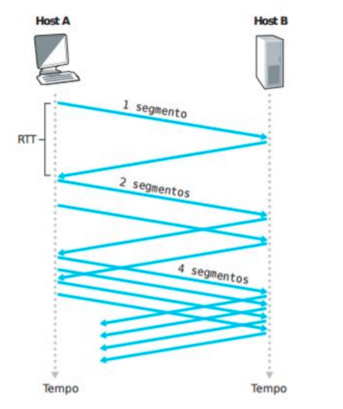
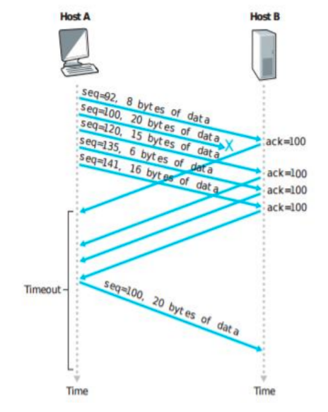

# Final Project Definition

You must implement an application using the **UDP protocol** that simulates the behavior of a **connection-oriented file transfer protocol**. To do this, the following mechanisms must be implemented:

* Connection establishment and termination
* Message sequencing
* Message error control
* Data transmission (files selected from the computer)
* Congestion control

The application should implement **two congestion control techniques** used by the TCP protocol:

* **Slow Start**: This technique has exponential growth. The idea is that the application starts by sending **one packet**, and increases the sending rate (2, 4, 8, 16...) as acknowledgments (ACKs) are received from the destination.
* **Fast Retransmit**: A technique that **immediately retransmits a packet** when 3 duplicate ACKs are received.

|
:-------------------------:|:-------------------------:
**Figure 1:** Slow Start | **Figure 2:** Fast Retransmit

There is no need to define a transmission window size. A packet may be retransmitted due to **timeout** or **3 duplicate ACKs**. In both cases, the application must restart the **Slow Start**, i.e., resume transmission with one packet and grow exponentially.

**Sequence numbers** must start at 0 and increase according to the number of packets being transmitted. The **ACK number** represents the sequence number + 1 — indicating the next packet the destination expects to receive.

**Error control** must be handled by the application using an existing **CRC calculation algorithm**. The CRC value should be included in each packet, and the destination must recalculate the CRC upon reception to check if the packet arrived correctly. If the packet is valid, an **ACK with sequence number + 1** must be sent. Otherwise, the packet should be discarded **without sending an ACK**.

All packets received must be acknowledged, and the destination must **track received sequence numbers**. It **cannot acknowledge** a packet with a higher sequence number if one with a lower number hasn’t been confirmed. In that case, the destination should resend an ACK for the **last confirmed packet**.

The user running the application must choose a file from their operating system to send to the destination (file path passed as a parameter). This file must be split into **512-byte chunks** and transmitted to the destination, implementing the above congestion control techniques. The receiver must reassemble all parts into a single file. All application-level packets must be **512 bytes**, including the last one — so **padding** must be added if the last packet is smaller.

After the file transfer, the user must run the `md5sum` or `shasum` command (on both source and destination) to validate the integrity of the received file.

As for the type of sockets used, communication must be implemented with **UDP sockets (Datagram Sockets)** for sending and receiving messages.

To simulate **packet loss**, use:

* [netem](http://www.linuxfoundation.org/collaborate/workgroups/networking/netem) on Linux
* [clumsy](https://github.com/jagt/clumsy) on Windows

During file transmission, the application must **print logs** to the screen to show what's happening on both the source and destination sides.

---

## General Rules

**Groups**: Maximum of 3 students.

**Submission and Presentation Date**: June 29

**Note**: All participants must be present.

**Final submission on Moodle must include**:

* A **document** describing the structure of the solution (packet format), including:
  * data structures,
  * threads,
  * procedures (or classes),
  * synchronization mechanisms used.
* **Commented source code**

---

**IMPORTANT**:
Late submissions will **not be accepted**.
Projects that **do not compile or run** will **not be evaluated**.
All submissions will be **analyzed and compared**.
If plagiarism is detected, **all involved groups will receive a grade of ZERO.**